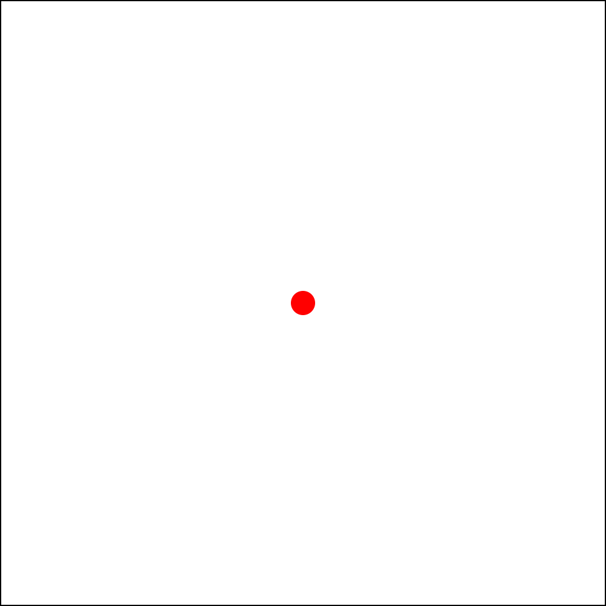
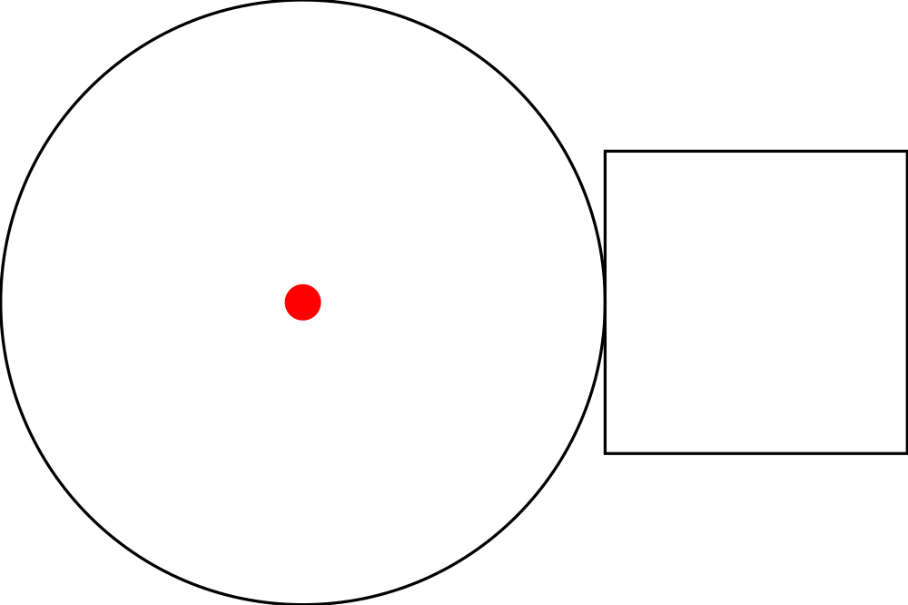
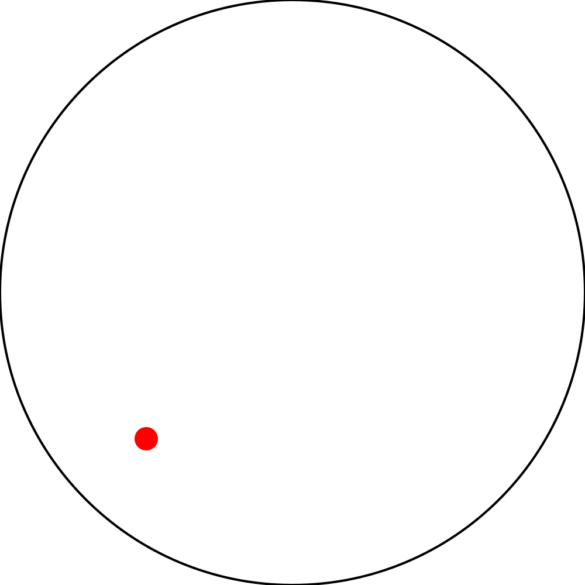
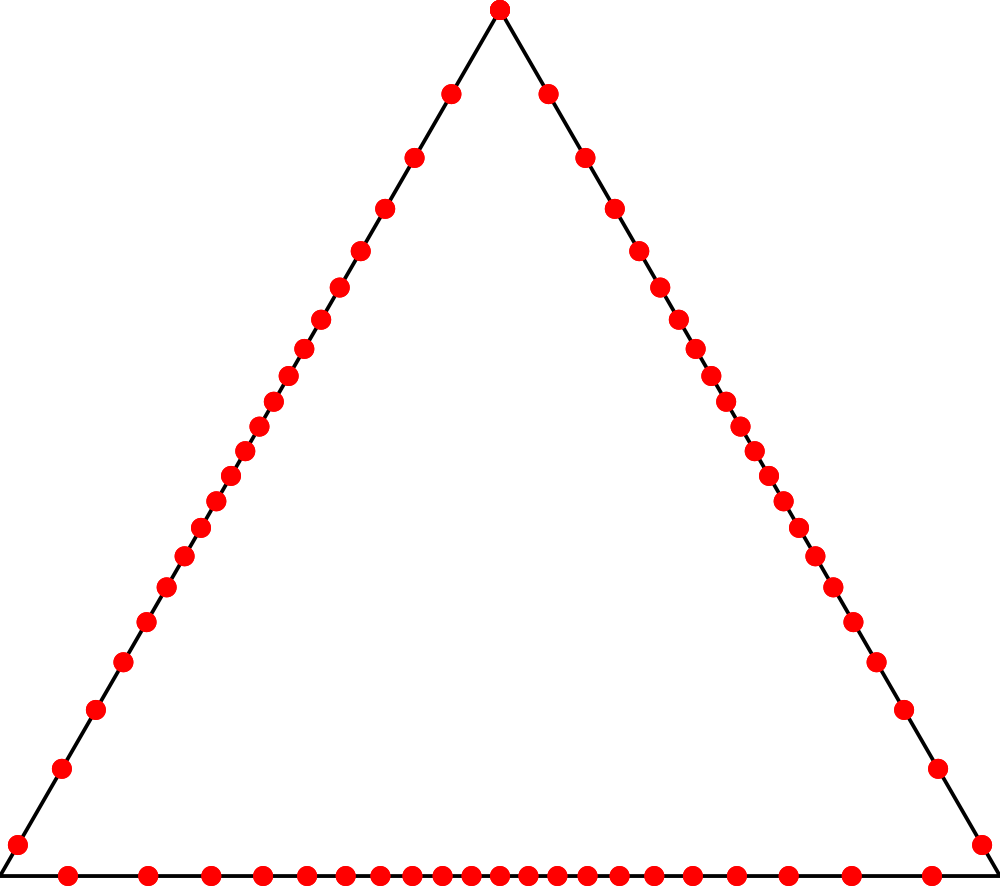
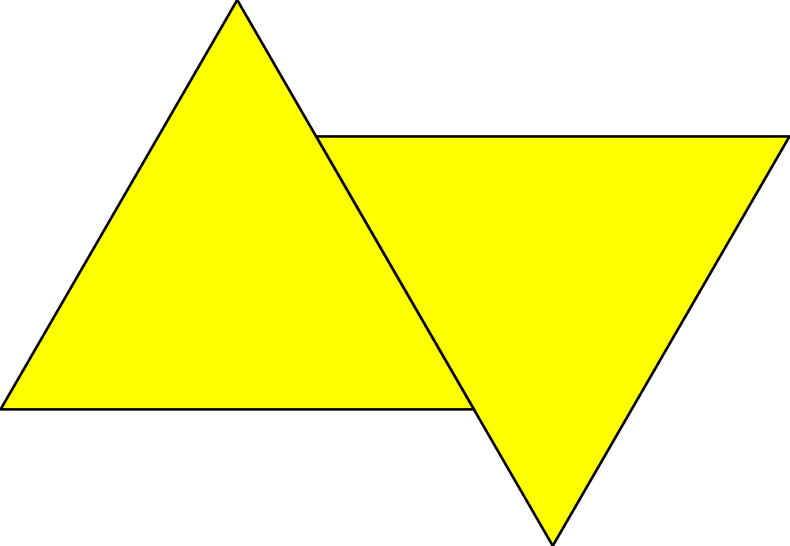
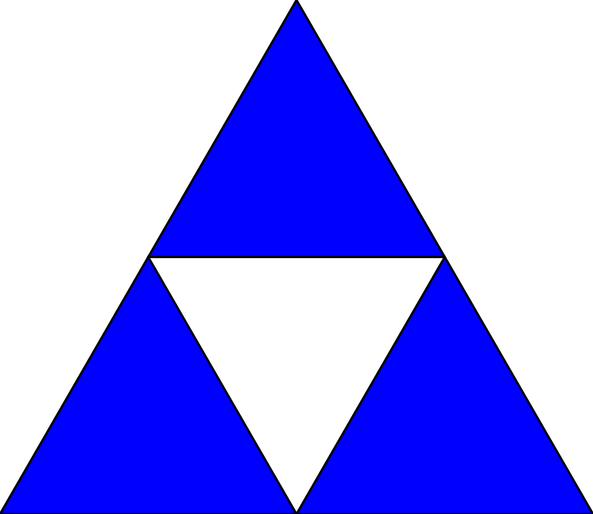
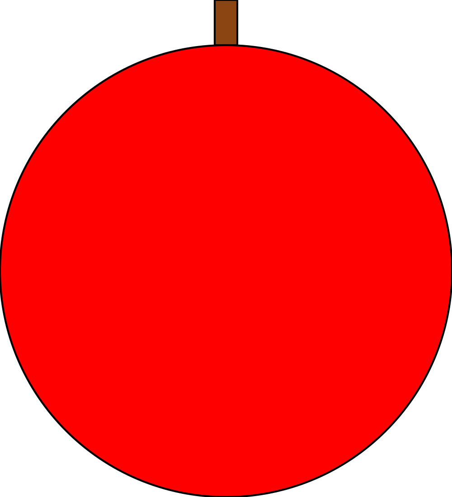
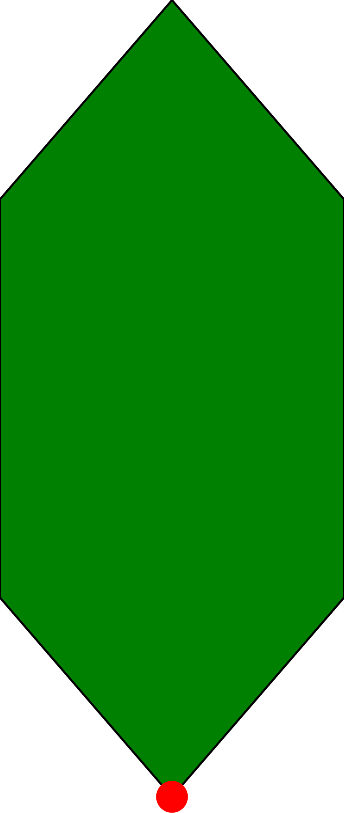
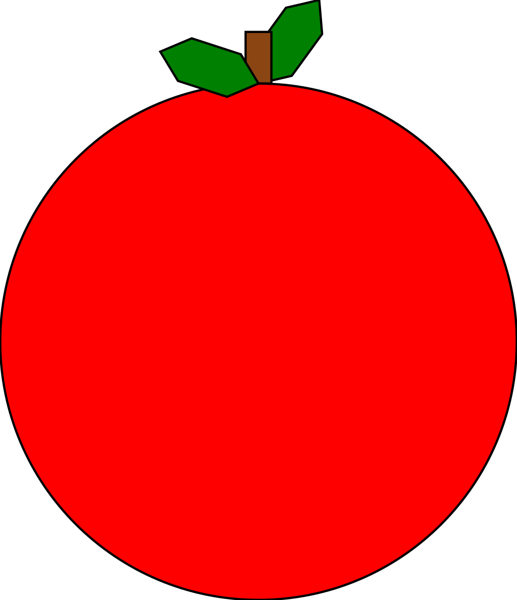

# Basic Diagrams

Let's draw some pretty pictures. After all this book is called **Haskell Through
Diagrams**.

`diagrams` is a Haskell library for drawing graphics.

## Primitives

Load up GHCi while in the project directory then try the following.

```
λ> rendered "triangle" (triangle 1)
```


```
λ> rendered "circle" (circle 1)
```


```
λ> rendered "pentagon" (pentagon 1)
```


Open "diagrams/triangle.svg", "diagrams/circle.svg", and
"diagrams/pentagon.svg" and you should see a triangle, circle, and a pentagon.
Just as shown above.

Those were all just outlines. What if we want a filled shape instead?

```
λ> draw (fillColor black (triangle 1))
```


> `draw` is the same as `rendered "tmp"`. It exists to make it easier to iterate
> on diagrams for the purpose of this tutorial. You can just open it in a
> browser and refresh every time you use `draw` again.

## Modifiers

Diagrams are crafted by taking simple diagrams and modifying them using
functions.

Here are a few functions that can modify existing diagrams or create simple
diagrams to try with `draw`.

- change the fill: `fc` or `fillColor` (use colors like `black`, `blue`,
  `green`, or most other common color names)
- change the outline: `lc` or `lineColor`
- change the opacity: `fillOpacity`

> If you tried checking the type signature of any of the functions associated
> with diagrams you might have noticed that they are absurdly complex. Not only
> do they have constraints like the functions involving arithmetic that we saw
> in the previous chapter but they also contain "type functions" and a lot of
> other complicated things. Don't worry about this too much for now. We will
> discuss the type signatures in greater detail when we discuss some of the more
> advanced features of Haskell's type system later. For now whenever I introduce
> new functions, with complicated type signatures, I will give them mock type
> signatures describe what the types are conceptually at a more concrete level.
> If I put a type in quotes its not a real type just a word to describe what
> that type is.
>
> `fillColor :: "Color" -> "Diagram" -> "Diagram"`
> `lineColor :: "Color" -> "Diagram" -> "Diagram"`
> `fillOpacity :: "Double" -> "Diagram" -> "Diagram"`

> A complete list of the default colors can be found
> [here](http://hackage.haskell.org/package/colour-2.3.3/docs/Data-Colour-Names.html).
> If you find yourself desiring even more colors than the ones already
> accessible type `import qualified Diagrams.Color.XKCD as C` in GHCi and you
> will have access to all of the colors that you can find listed at
> xkcd.com/color/rgb written in *camelCase* prefixed by `C.`. For example, "blue
> with a hint of purple" would be written `C.blueWithAHintOfPurple`. You can
> also use arbitrary RGB colors like `sRGB 0 0.5 1.0` (with color components
> from 0 - 1.0) or `sRGB24 255 0 127` (color components ranging from 0 - 255).

## Combiners

Lets try combining some diagrams now to make something a little more complex
than a single shape. Because there are a number of different ways to combine
diagrams with each other logically, diagrams provides several different
operators for combining diagrams.

Try running the following examples and then figure out how they combine the two
diagrams they take as operands. Each takes two diagrams and produces a new one.

- `draw (triangle 1 ||| triangle 2)`
- `draw (square 1 === pentagon 4)`
- `draw (circle 10 <> circle 5)`
- `draw ((circle 1 === circle 1) <> circle 1)`
- `draw (fillColor purple (triangle 1 === square 1))`

Now you might have noticed that if you want to chain a bunch of things together
it takes a bunch of parenthesis, and is a little confusing to read. To solve
those problems we have two operators: `$` and `#`. Both of these operators apply
a function to a thing but they do it differently. Here are a couple of examples:

- `draw $ lc green $ circle 1 <> circle 2 <> circle 3`
- `circle 1 <> circle 2 <> circle 3 # lc green # draw`
- `draw $ circle 1 <> circle 2 <> circle 3 # lc green`

Each of these does the exact same thing, just rearranged slightly differently.
Checking the types of these operators

```
λ> :t ($)
($) :: (a -> b) -> a -> b
λ> :t (#)
(#) :: a -> (a -> b) -> b
```

we can see that one of them applies a function to the thing that comes before it
and the other applies a function to the thing that comes after it. `#` has a
higher precedence than `$` (think multiplication comes before addition), which
is why the third example works properly.

## Transformations

Now we know how to create diagrams, combine them, and color them. As far as
manipulating pictures goes it seems we are only missing one major thing:
transforming diagrams. We can translate, rotate, and scale diagrams
using functions with the following signatures:

```
scale :: "Size" -> "Diagram" -> "Diagram"
rotate :: "Angle" -> "Diagram" -> "Diagram"
translate :: "Vector" -> "Diagram" -> "Diagram"
```

Now since those function signatures aren't exactly as enlightening as we might
like them to be, here is a little section on each one.

### `scale`
This scales a diagram by some amount, uniformly, in every dimension. If you
noticed earlier, each of the primitive shapes does the same thing (e.g. `square
0.5 = square 1 # scale 0.5`). If you want to scale a shape by one dimension, you
can do that with `scaleX` and `scaleY`, which work exactly how you probably
expect.

### `rotate`
This rotates a diagram by an angle. What is an angle? An angle is basically a
floating point number along with the unit of the angle. There are 3 different
units that you can use for your angles.

```
λ> 1 @@ turn
6.283185307179586 @@ rad
λ> 360 @@ deg
6.283185307179586 @@ rad
λ> 2 * pi @@ rad
6.283185307179586 @@ rad
```

> `(@@)` is a weird operator that is used to append an operator to a number by
> diagrams. Please don't ask to me to explain its type until at least 5 chapters
> from now...

Internally all angles use radians. There are also a few common angles provided:
`fullTurn`, `halfTurn`, `quarterTurn`. If you just want to rotate by turns (aka
multiples of τ), you can use the function `rotateBy :: "Size" -> "Diagram" ->
"Diagram"`.

### `translate`
This translates the local origin of a diagram to a new vector, using the current
local coordinate system. First we construct a vector to pass to translate.

```
λ> r2 (1, 1.5)
V2 1.0 1.5
```

Next it is important to understand what the local origin of a diagram is and
what it does. You can show the origin of a diagram by using `showOrigin ::
"Diagram" -> "Diagram"`. The local origin starts at the center for primitive
diagrams.

```
λ> draw $ showOrigin $ square 1
```


However when combining diagrams the original origin is maintained.

```
λ> draw $ showOrigin $ circle 1 ||| square 1
```


Using translate moves the local origin, relative to where the local origin used
to be at.

```
λ> draw $ showOrigin $ circle 1 # translate (r2 (0.5, 0.5))
```


But when we combine a translated image with another, it doesn't appear like the
translation had the effect we expected exactly. It will be a little while before
we know enough to understand what is going on here exactly.

```
λ> draw $ circle 1 ||| circle 1 # translate (r2 (0.5, 0.5))
```


However, when we combine images with `<>` the translation has exactly the effect
we expected. The local origins of the two diagrams are placed on top of one
another.

```
λ> draw $ circle 1 <> circle 1 # translate (r2 (0.5, 0.5))
```


So using `<>` in addition with `translate` it is in fact possible to combine
diagrams however you want, and position them as exactly as desired, to pixel
perfect precision.

### Other Ways to Translate
Using `translate` is somewhat tedious, as it requires you to very precisely
specify how to move the origin. For the special case of moving the origin to
some specific point on the edge of the shape there are a couple of handy helper
methods all named `align` or `snug` with some suffix. The suffix tells you where
it puts the origin and `align` and `snug` differ in how close they move the
origin to the edge of the shape.

`align` uses the envelope of the diagram. The envelope is a rough approximation
of the boundaries of the shape that is easily computed. We can check out the
envelope by using `showEnvelope`.

```
λ> draw $ triangle 1 # showEnvelope
```


`snug` uses the trace of the diagram. The trace of the diagram is a much, much
closer approximation of the boundaries of the diagram than the envelope. It is
however much more expensive to compute than the envelope. The cost of computing
the trace won't matter too much though, until we start creating much larger
diagrams. We can check out the trace by using `showTrace`. This shows some of
the points in the trace (50 to be exact).

```
λ> draw $ triangle 1 # showTrace
```


In general use `snug` if you want two diagrams to be touching each other
precisely and `align` if they just need to be near each other. Both `align` and
`snug` have tons of suffixes that push the origin toward one side of the shape
using the trace. Here is an example of how to use `snug` to position two upside
down triangles right next to one another.

```
λ> let t = triangle 1 # fc yellow
λ> draw $ t # snugR <> t # rotateBy 0.5 # snugL
```



### Composing Transformations
Now that you know how to transform diagrams in a variety of ways, you may find
yourself desiring a function that does several transformations at once. This is
quite easy to accomplish using `.` the function composition operator.

```
λ> let scaleThenMove = translate (r2 (0.5, 0)) . scale 0.5
λ> draw $ circle 1 <> circle 1 # scaleThenMove
```


> Remember we used `let` in the previous chapter to declare intermediate
> variables.

## Try It
Now you know how to do a lot of different things with diagrams, and it is time
to create a few on your own. I provide a few diagrams as goals that you might
try to create. You can find the code that I used to generate the diagrams
provided in the file `src/Diagrams/Book/Chapter3.hs`, each as a single
definition with the name I have given it here. Before cheating though, seriously
try to make the diagram your self first. I don't think any of the ones here
would be too hard to make. Also, note that none of the diagrams here requires
much (if any) tedious translation of the origin by hand. Other than size and
angles (which are fine if they are only close), everything can be done without
explicit numbers. A glossary of functions is available below the exercises for
reference.

> If you aren't sure what a command is doing and it doesn't have a visual
> effect, try using the command I list under debugging diagrams in order to see
> how it is transforming the origin of the diagram. The envelope and trace are
> both different kinds of boundaries for a diagram.
>
> In particular you might need to do this for the `align` and `snug` commands.

ch3ex1


ch3ex2


ch3ex3

> The red dot here is just the result of show origin. You will need the origin
> where it is shown here for the next exercise.



ch3ex4

> Combine your diagrams from ch3ex2 and ch3ex3 to make this one.



ch3ex5


## Glossary
Here is a list of functions that I used in this chapter, or very similar
functions that you should be able to easily figure out how to use.

### Primitive Shapes
```
triangle :: "Size" -> "Diagram"
```
```
square :: "Size" -> "Diagram"
```
```
pentagon :: "Size" -> "Diagram"
```
```
hexagon :: "Size" -> "Diagram"
```
```
regPoly :: Int -> "Size" -> "Diagram"
```
```
rect :: "Size" -> "Size" -> "Diagram"
```
```
roundedRect :: "Size" -> "Size" -> "Size" -> "Diagram"
```
```
circle :: "Size" -> "Diagram"
```
```
elipse :: "Size" -> "Diagram"
```
```
elipseXY :: "Size" -> "Size" -> "Diagram"
```

### Aesthetic Modification
```
fillColor :: "Color" -> "Diagram" -> "Diagram"
```
```
fc :: "Color" -> "Diagram" -> "Diagram"
```
```
lineColor :: "Color" -> "Diagram" -> "Diagram"
```
```
lc :: "Color" -> "Diagram" -> "Diagram"
```
```
fillOpacity :: Double -> "Diagram" -> "Diagram"
```

### Combiners
```
atop :: "Diagram" -> "Diagram" -> "Diagram"
```
```
beneath :: "Diagram" -> "Diagram" -> "Diagram"
```
```
(<>) :: "Diagram" -> "Diagram" -> "Diagram"
```
```
beside :: "Vector" -> "Diagram" -> "Diagram" -> "Diagram"
```
```
(|||) :: "Diagram" -> "Diagram" -> "Diagram"
```
```
(===) :: "Diagram" -> "Diagram" -> "Diagram"
```

### Transformations
```
scale :: "Size" -> "Diagram" -> "Diagram"
```
```
scaleX :: "Size" -> "Diagram" -> "Diagram"
```
```
scaleY :: "Size" -> "Diagram" -> "Diagram"
```
```
translate :: "Vector" -> "Diagram" -> "Diagram"
```
```
translateX :: "Size" -> "Diagram" -> "Diagram"
```
```
translateY :: "Size" -> "Diagram" -> "Diagram"
```
```
centerX :: "Diagram" -> "Diagram"
```
```
centerY :: "Diagram" -> "Diagram"
```
```
centerXY :: "Diagram" -> "Diagram"
```
```
align :: "Vector" -> "Diagram" -> "Diagram"
```
```
alignT :: "Diagram" -> "Diagram"
```
```
alignB :: "Diagram" -> "Diagram"
```
```
alignL :: "Diagram" -> "Diagram"
```
```
alignR :: "Diagram" -> "Diagram"
```
```
alignTL :: "Diagram" -> "Diagram"
```
```
alignBL :: "Diagram" -> "Diagram"
```
```
alignTR :: "Diagram" -> "Diagram"
```
```
alignBR :: "Diagram" -> "Diagram"
```
```
alignX :: "Double" -> "Diagram" -> "Diagram"
```
```
alignY :: "Double" -> "Diagram" -> "Diagram"
```
```
snug :: "Vector" -> "Diagram" -> "Diagram"
```
```
snugT :: "Diagram" -> "Diagram"
```
```
snugB :: "Diagram" -> "Diagram"
```
```
snugL :: "Diagram" -> "Diagram"
```
```
snugR :: "Diagram" -> "Diagram"
```
```
snugX :: "Double" -> "Diagram" -> "Diagram"
```
```
snugY :: "Double" -> "Diagram" -> "Diagram"
```
```
rotate :: "Angle" -> "Diagram" -> "Diagram"
```
```
rotateBy :: "Size" -> "Diagram" -> "Diagram"
```
```
reflectX :: "Diagram" -> "Diagram"
```
```
reflectY :: "Diagram" -> "Diagram"
```

### Debugging Diagrams
```
showEnvelope :: "Diagram" -> "Diagram"
```
```
showOrigin :: "Diagram" -> "Diagram"
```
```
showTrace :: "Diagram" -> "Diagram"
```
